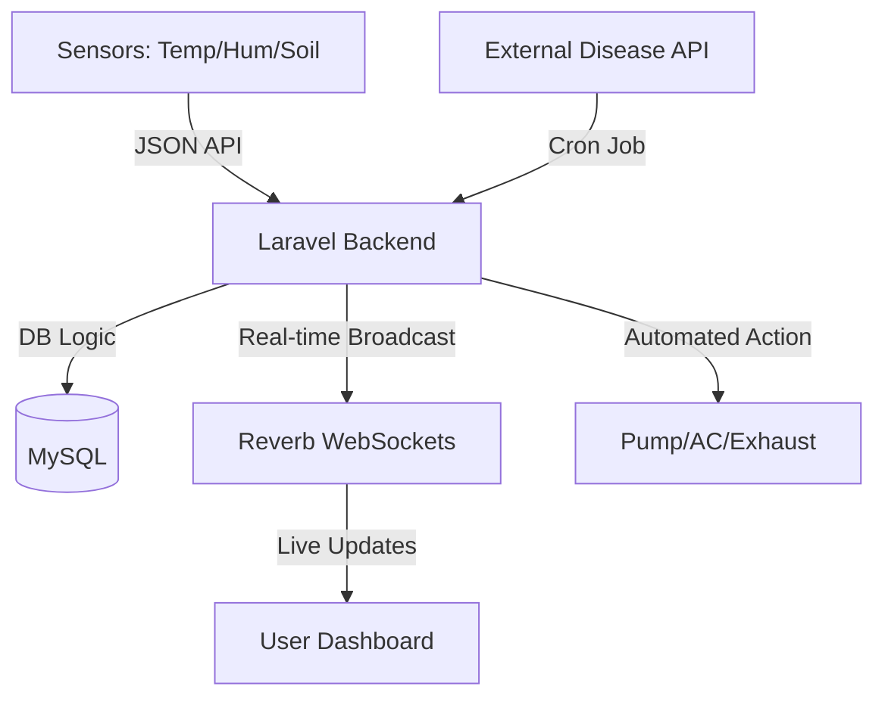

# 🌿 Greenhouse Monitoring Ecosystem: Stakeholder Handbook
**Comprehensive Integration & Technical Overview**

---

## 💎 Project Essence
The **Greenhouse Monitoring System** is a next-generation IoT solution designed to bridge the gap between biological needs and digital precision. It empowers users with real-time telemetry, autonomous decision-making, and intelligent plant care recommendations.

---

## 🏗️ High-Level Architecture
The ecosystem leverages a low-latency stack to ensure environmental stability.

---

## 🚀 Key Innovation Pillars

### 🤖 Intelligent Autonomous Control
A hybrid control system that adapts to your growth strategy.
> [!TIP]
> **Auto-Pilot Mode**: The system uses decoupled automation traits to manage climate 24/7. It handles logic for Pumps (Soil Moisture), AC (Temperature), and Exhaust (Humidity) simultaneously.

### 📍 Local Climate Intelligence (Area Temp)
Goes beyond local data by calculating real-time averages of all greenhouses in the same city.
- **Why it matters**: Allows users to compare their internal climate against the broader regional environment for better cultivation decisions.

### �️ Disease Defense System
Proactive plant protection through automated intelligence gathering.
- **4-Hour Sync**: The system pulls the latest disease profiles and treatments from trusted global sources every 4 hours.

---

## 📡 API Interface Blueprint
Fully documented for seamless integration with mobile or web clients.

| Service | Endpoint | Priority | Dynamic Trigger |
| :--- | :--- | :--- | :--- |
| **Telemetry Ingestion** | `/api/sensor-data` | 🔥 Critical | Broadcasts to Dashboard |
| **Automation Sync** | `/api/greenhouse/sync` | ⚡ High | Runs logic from DB |
| **Disease Library** | `/api/disease` | 📚 Information | Cron-synced data |
| **Manual Override** | `/api/device-control`| 🛠️ Operational | Blocks auto-mode safety |

---

## 🛠️ System Health & Maintenance

### Operational Dashboard Links
- 📘 **[Postman API Guide](file:///home/ashlin/Desktop/greenhouse_main/greenhouse_main/docs/postman_guide.md)**
- 📡 **[WebSocket Data Flow](file:///home/ashlin/Desktop/greenhouse_main/greenhouse_main/docs/websocket_documentation.md)**
- ⚙️ **[Logic Documentation](file:///home/ashlin/Desktop/greenhouse_main/greenhouse_main/docs/greenhouse_settings_logic.md)**

### Management Summary 📈
- **Uptime**: Designed for 24/7 operation with persistent worker handlers.
- **Scalability**: Capable of handling hundreds of concurrent IoT payloads per second.
- **Security**: Hardened via Laravel Sanctum tokenization and Fortify user management.

---

> [!IMPORTANT]
> This project is currently in **Feature-Complete** status. All documentation is integrated and the backend is live on the development server.
