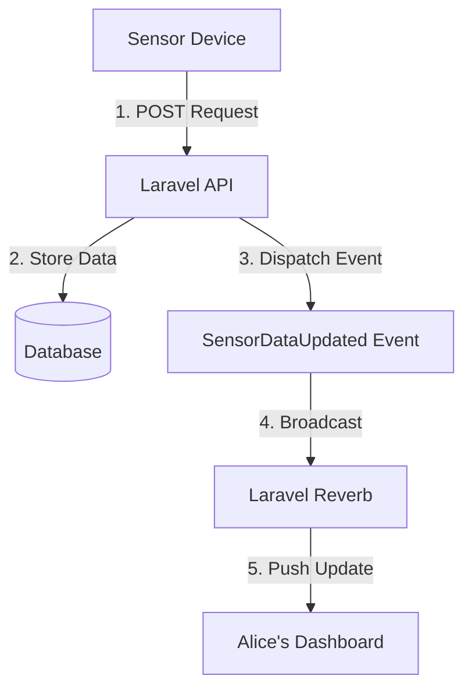

# Sensor & WebSocket Documentation (Alice's Example)

This document explains how sensor data flows from a device to the dashboard in real-time using Laravel Reverb.

## 1. The Data Flow
The process follows these four main steps:



---

## 2. Step-by-Step Example: Alice
Let's use Alice's Greenhouse (Product ID: `GH-112233`) as an example.

### A. Sending Sensor Data
Alice's sensor device sends a `POST` request to the backend every few seconds.

**Endpoint:** `POST /api/sensor-data`  
**Payload:**
```json
{
    "device_id": "GH-112233",
    "temperature": 24.5,
    "humidity": 65.0,
    "soil_moisture": 40.2
}
```

### B. Backend Processing
The `SensorDataController` receives this data and:
1.  **Saves** it to the `sensor_readings` table for history.
2.  **Dispatches** the `SensorDataUpdated` event.

### C. Live Broadcasting (WebSockets)
The `SensorDataUpdated` event is configured to broadcast on a specific channel:
- **Channel Name:** `greenhouse.GH-112233`
- **Data Broadcasted:**
    ```json
    {
        "temperature": 24.5,
        "humidity": 65.0,
        "soil_moisture": 40.2
    }
    ```

### D. Client-Side (The Dashboard)
Alice's dashboard (frontend) listens for updates on that specific channel using **Laravel Echo**:

```javascript
Echo.channel('greenhouse.GH-112233')
    .listen('SensorDataUpdated', (e) => {
        console.log('New sensor data received:', e);
        // Update the UI charts and gauges here
    });
```

---

## 3. How to Test Live Updates
1.  **Start Reverb:** Ensure `php artisan reverb:start` is running.
2.  **Open Dashboard:** Open Alice's dashboard in your browser.
3.  **Simulate Sensor:** Use Postman to send a `POST` request to `/api/sensor-data` with Alice's `device_id`.
4.  **Observe:** You will see the values update instantly on the dashboard without refreshing the page!

> [!IMPORTANT]
> Because it's a public channel (`greenhouse.{deviceId}`), anyone with the Product ID can listen to the data. For production, you might want to switch to a `PrivateChannel` in `routes/channels.php`.
